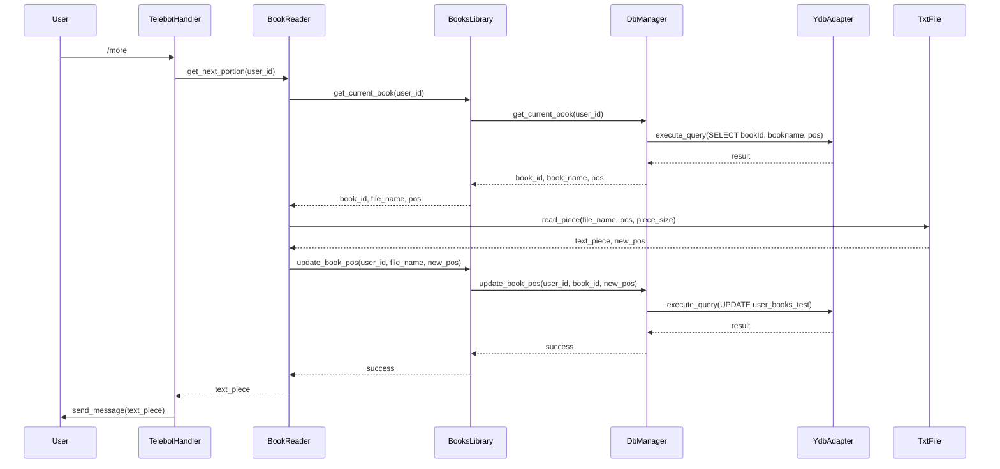

# Описание обработчика more
Все вызовы, связанные с командой `/more`. Сначала поищем в коде упоминания этой команды.

Текстовое описание процесса:

1. Пользователь отправляет команду `/more`
2. `TelebotHandler` получает сообщение и вызывает метод `get_next_portion(user_id)` класса `BookReader`
3. `BookReader` запрашивает текущую книгу пользователя через `BooksLibrary.get_current_book(user_id)`
4. `BooksLibrary` обращается к `DbManager` для получения информации о книге
5. `DbManager` выполняет SQL-запрос через `YdbAdapter` для получения ID книги, названия и текущей позиции
6. Полученная информация передается обратно через цепочку вызовов до `BookReader`
7. `BookReader` использует `TxtFile` для чтения следующей порции текста из файла книги
8. После чтения текста, `BookReader` обновляет позицию в книге через `BooksLibrary.update_book_pos()`
9. Обновление позиции проходит через `DbManager` и `YdbAdapter` для сохранения в базе данных
10. Прочитанный текст возвращается в `TelebotHandler`
11. `TelebotHandler` отправляет текст пользователю

Важные особенности:
- Система использует YDB (Yandex Database) для хранения данных
- Книги хранятся в текстовых файлах, а в базе данных хранятся только метаданные
- Позиция чтения (pos) обновляется после каждого чтения порции текста
- Система поддерживает многоязычность (ru/en)
- Есть поддержка автоматической отправки порций текста (isAutoSend)
